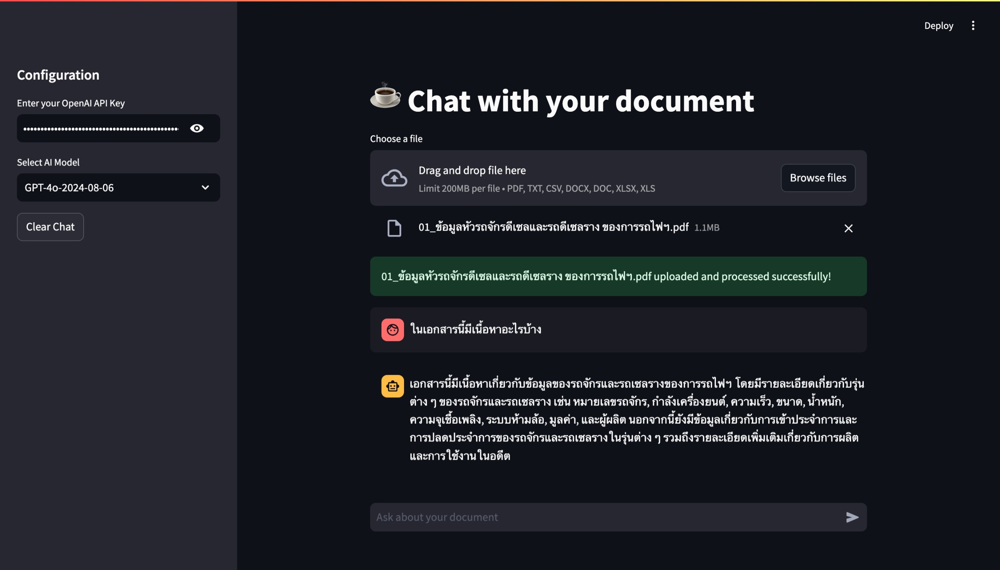
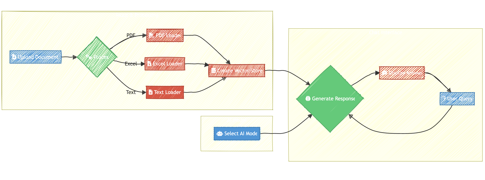

# Document Chat App

This Streamlit application allows users to chat with their documents using OpenAI's language models. Upload a document, and the app will use AI to answer questions about its content.

## Screenshot



## Flow chart


## Features

- Support for multiple file types (PDF, TXT, CSV, DOCX, XLSX)
- Integration with OpenAI's GPT models (GPT-3.5, GPT-4, etc.)
- Interactive chat interface
- Document processing with LangChain
- Vector storage using FAISS for efficient retrieval

## Prerequisites

Before you begin, ensure you have met the following requirements:

- Python 3.7+
- An OpenAI API key

## Installation

1. Clone the repository:
   ```
   git clone https://github.com/yourusername/document-chat-app.git
   cd document-chat-app
   ```

2. Install the required packages:
   ```
   pip install -r requirements.txt
   ```

## Usage

1. Run the Streamlit app:
   ```
   streamlit run app.py
   ```

2. Open your web browser and go to `http://localhost:8501`.

3. Enter your OpenAI API key in the sidebar.

4. Upload a document (PDF, TXT, CSV, DOCX, or XLSX).

5. Start chatting with your document!

## Configuration

You can select different OpenAI models from the dropdown in the sidebar. Available models include:

- GPT-3.5
- GPT-4o
- GPT-4o-Mini
- GPT-4o-2024-08-06

## Contributing

Contributions to the Document Chat App are welcome. Please feel free to submit a Pull Request.

## License

This project is licensed under the MIT License - see the [LICENSE.md](LICENSE.md) file for details.

## Acknowledgments

- [Streamlit](https://streamlit.io/) for the web app framework
- [LangChain](https://python.langchain.com/) for document processing and chat functionality
- [OpenAI](https://openai.com/) for the language models and embeddings

